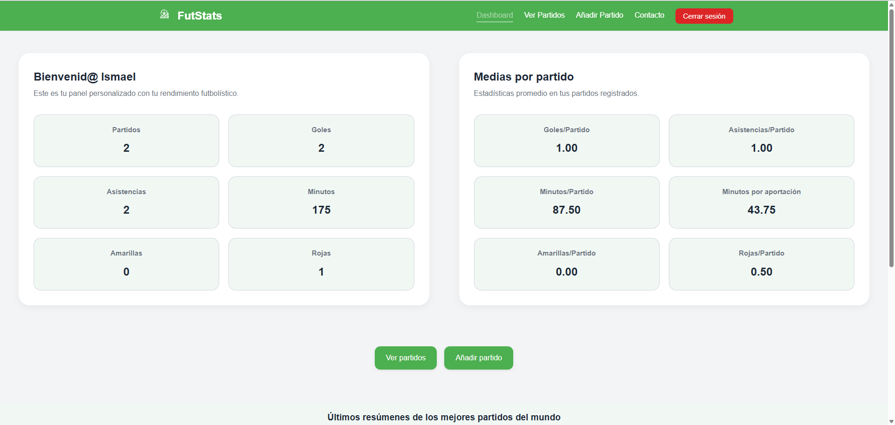

# 🌐 Portfolio de Ismael Sierra Vega

Este es el portfolio personal de **Ismael Sierra Vega**, desarrollado como una aplicación web moderna con React. El objetivo es presentar mi perfil profesional, proyectos destacados, habilidades y datos de contacto de forma clara, responsiva y visualmente atractiva.

---

## 🚀 Tecnologías utilizadas

- **React** (Vite)
- **JavaScript moderno (ES6+)**
- **CSS modular y responsive (Mobile First)**
- **Modo oscuro integrado**
- **EmailJS** para enviar correos desde el formulario de contacto
- **Despliegue en Vercel**

---

## 📸 Capturas de pantalla

Puedes ver una demo en producción aquí:  
🔗 [https://futstats.vercel.app](https://futstats.vercel.app)



---

## 🧰 Estructura del proyecto

```
portfolio/
├── public/
│   └── assets/                # Imágenes y recursos del portfolio
├── src/
│   ├── components/            # Navbar, Footer
│   ├── pages/                 # Home, About, Projects, Contact
│   ├── index.css              # Archivo .css principal
│   └── App.jsx                # Estructura principal y router
├── index.html
├── vite.config.js             # Configuración Vite
└── package.json
```

---

## ⚙️ Instalación local

1. Clona el repositorio:

```bash
git clone https://github.com/ismael-sierra/portfolio-ismael-sierra
cd tu-repo
```

2. Instala las dependencias:

```bash
npm install
```

3. Crea un archivo `.env` con tus credenciales de EmailJS:

```env
VITE_EMAILJS_SERVICE_ID=tu_service_id
VITE_EMAILJS_TEMPLATE_ID=tu_template_id
VITE_EMAILJS_PUBLIC_KEY=tu_public_key
```

4. Ejecuta la aplicación en desarrollo:

```bash
npm run dev
```

---

## ☁️ Despliegue en Vercel

Este proyecto está desplegado automáticamente con [Vercel](https://vercel.com).  
Para desplegarlo tú mismo:

1. Sube tu repositorio a GitHub.
2. Entra en [https://vercel.com](https://vercel.com), vincula tu cuenta de GitHub.
3. Importa el proyecto, configura la **Build Command** como `npm run build` y el **Output Directory** como `dist`.

---

## 🧠 Funcionalidades destacadas

- ✅ Modo claro / oscuro con `useState` y `useEffect`.
- ✅ Menú hamburguesa para móviles.
- ✅ Carrusel de proyectos con scroll infinito automático.
- ✅ Formulario de contacto funcional con EmailJS.
- ✅ Diseño responsivo en todos los tamaños de pantalla.

---

## 📩 Contacto

- LinkedIn: [linkedin.com/in/ismael-sierra-vega](https://www.linkedin.com/in/ismael-sierra-vega/)
- GitHub: [github.com/ismael-sierra](https://github.com/ismael-sierra)
- Email: ismaelsierravega2003@gmail.com *(protegido en el formulario de contacto)*

---

## 📝 Licencia

Este proyecto es de uso personal y educativo. Siéntete libre de revisarlo, pero no lo distribuyas como propio.

---
